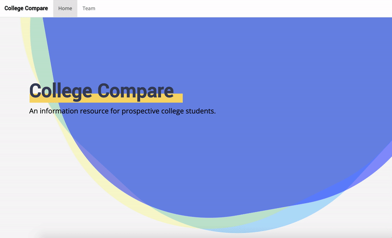

<h1 align="center">College Compare</h1>

<h4 align="center">A web app for helping prospective college students make more informed decisions about their choice of college.</h4>

  <a href="#application-demo">Application Demo</a>&nbsp;|&nbsp;<a href="#project-description">Project Description</a>&nbsp;|&nbsp;<a href="#license">License</a>

## Application Demo

Link to Shiny App: [College Compare](https://hawkticehurst.shinyapps.io/College_Compare/)

## Project Description

_Final group project for INFO 201: Intellectual Foundations of Informatics at the University of Washington (Autumn 2018)._

College Compare is a web app for helping prospective college students make more informed decisions about their choice of college. We used [College Scorecard Data](https://collegescorecard.ed.gov/data/) collected by the U.S. Department of Education. As defined in the College Scorecard documentation,

> "This project provides data to help students and families compare college costs and outcomes as they weigh the tradeoffs of different colleges, accounting for their own needs and educational goals.” 

The target audience we focused on was high school upperclassmen and their families who are preparing for and exploring college options. When filtering through this data, we found four areas of interest that we thought would be particularly helpful to this target audience. Utilizing this data, we answered the following questions:

1. What are the costs of college by state? Filter further by in-state vs. out-of-state tuition.
2. What colleges have the highest post-college average earnings depending on Public, Private Nonprofit, and Private For-Profit colleges?
3. What colleges have the best repayment rate (for 1, 3, 5, and 7 years) based on family income?
4. Which schools have the greatest cumulative median debt disaggregated by income groups?

## License

[MIT](LICENSE)
